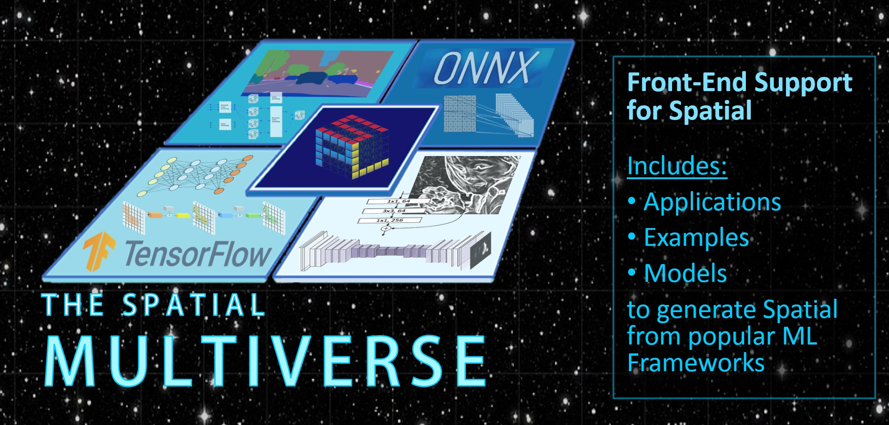

# The Spatial Multiverse



## Introduction

The Spatial Multiverse in an ongoing research project which exists around the [Spatial](https://github.com/stanford-ppl/spatial) Language and Compiler. It provides Spatial with front-end support from popular machine learning (ML) frameworks.

The Spatial Multiverse contains:

1. Spatial as a submodule
2. Tools to compile ML frameworks to Spatial in order to target hardware accelerators, and
3. Examples of models and applications in these frameworks

This allows ML frameworks to be mapped to programmable hardware.


## TensorFlow to FPGAs

In its initial version, the Spatial Multiverse supports mapping DNN models described in [TensorFlow](https://github.com/tensorflow/tensorflow) to FPGAs. It converts a TensorFlow trained model to a bitstream and C++ host program that can be run on an FPGA. We use Spatial as a hardware IR to generate C++/Verilog, and so we support whichever FPGAs are supported by Spatial. This includes the Amazon EC2 F1 FPGAs, which is what we have tested. Support for other DNN frameworks (through [ONNX](https://onnx.ai/)) is also planned and under development.

Click on the documentation links below to get started:
* [Installation](docs/installation.md)
* [Usage Instructions](docs/usage_instructions.md)
* [AWS F1 Instructions](docs/aws.md)
* [End-to-end Demo](docs/demo.md)
* [Overview of TensorFlow Support](docs/tensorflow.md)


## Citation

If you find the TensorFlow to Spatial compiler useful for your work, you can cite our FPL paper, e.g. as follows:
```
@inproceedings{hadjis19fpl,
  author = {S. Hadjis and K. Olukotun},
  title =  {TensorFlow to Cloud {FPGAs}: Tradeoffs for Accelerating Deep Neural Networks},
  year = {2019},
  booktitle = {Field Programmable Logic and Applications (FPL2019)},
  publisher = {IEEE}
}
```
