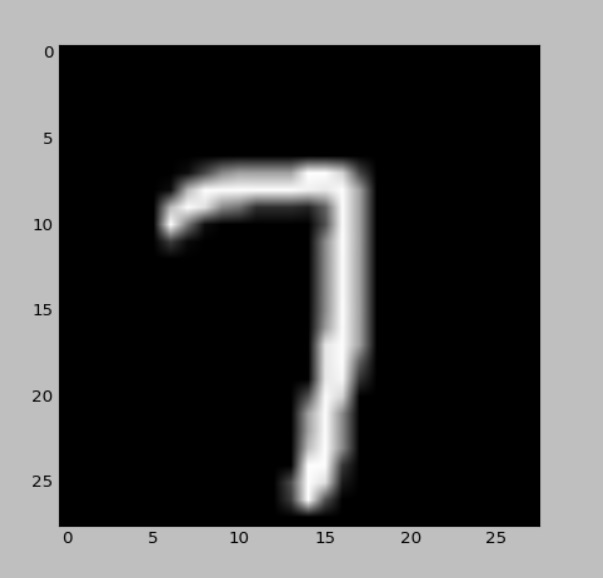
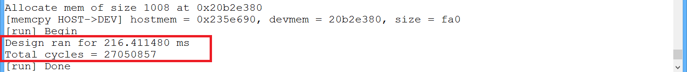
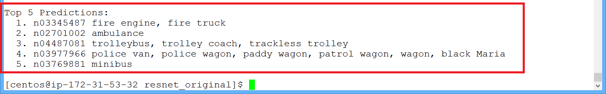
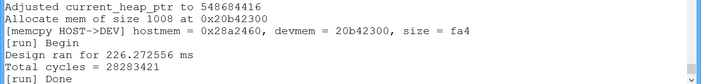
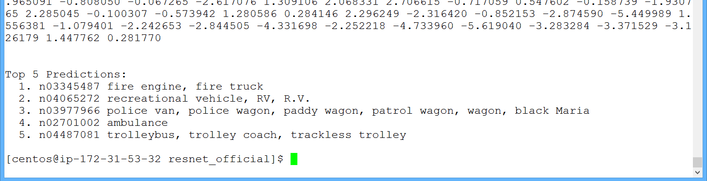
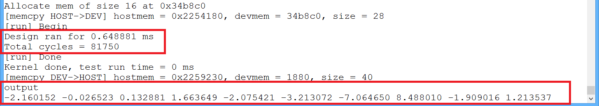

# TensorFlow to Cloud FPGAs: End-to-end Demo

## Contents

  * [Introduction](#introduction)
  * [Creating and Optimizing a TensorFlow Inference Graph](#creating-and-optimizing-a-tensorflow-inference-graph)
  * [Generating and Compiling Spatial](#generating-and-compiling-spatial)
  * [Creating and Visualizing Input Data](#creating-and-visualizing-input-data)
  * [Running on the F1](#running-on-the-f1)

## Introduction

This shows some end-to-end tutorials for running TensorFlow on the Amazon F1. We will look at 2 CNNs:

* LeNet
* ResNet-50 (two versions: Original Publication and Official TensorFlow)

Each one will highlight different aspects of the toolchain.
The steps to run examples are also provided in the example's `models` directory.

## Creating and Optimizing a TensorFlow Inference Graph

The Official TensorFlow ResNet example contains a [script](../models/resnet_official/get_resnet_official.sh) to download the model trained by Google.

Change into the `resnet_official` model example directory and run:

```
bash get_resnet_official.sh
```

Next, run the following commands to optimize the model.
Note these instructions are also provided in the example's [README](../models/resnet_official/README.md).

First, create the unoptimized inference graph:

```
python create_inference_graph.py saved_model models/resnet_official/resnet_v1_fp32_savedmodel_NHWC/1538686669 softmax_tensor  models/resnet_official/ resnet_official
```

Next, optimize it using TensorFlow's graph utilities:

```
python  optimize_inference_graph.py  models/resnet_official/resnet_official.pb  input_tensor  softmax_tensor  224,224,3
```

This script will create a new optimized graph.

For LeNet and the Original ResNet, the optimized models are already included in the models directory.

## Generating and Compiling Spatial

Once the optimizations are run, generate Spatial.
Once the `.scala` file is generated, follow the printed instructions to move the generated file to the Spatial `apps` directory and then run compilation.

### LeNet

```
python dnn_to_spatial.py models/lenet/lenet.pb
mv lenet.scala  spatial/test/spatial/tests/apps/
cd spatial
bin/spatial lenet --synth --forceFuseFMA --fpga=AWS_F1 && cd gen/lenet && make aws-F1
```

### Turning On ImageNet Classification

Now, modify `dnn_to_spatial` [here](../dnn_to_spatial.py#L35) to set `include_imagenet_classification` to `True`. Eventually this will be a flag passed into the script or part of a configuration file. It adds extra host code after the application execution completes which reads in the ImageNet class file and prints classification results.

Now generate Spatial for the ResNets as well.

### ResNet (Original)

```
python dnn_to_spatial.py models/resnet/ResNet50_opt.pb
mv resnet50opt.scala spatial/test/spatial/tests/apps/
cd spatial
bin/spatial resnet50opt --synth --forceFuseFMA --noBindParallels --fpga=AWS_F1 && cd gen/resnet50opt && make aws-F1
```

### ResNet (Official)

```
python dnn_to_spatial.py models/resnet_official/resnet_official_opt2.pb
mv resnetofficialopt2.scala spatial/test/spatial/tests/apps/
cd spatial
bin/spatial resnetofficialopt2 --synth --forceFuseFMA --noBindParallels --fpga=AWS_F1 && cd gen/resnetofficialopt2 && make aws-F1
```

## Creating and Visualizing Input Data

### LeNet

For LeNet, we've included an [example input](../models/lenet/7.csv).

To visualize this file, which is Grayscale, run:

```
python data/vis.py models/lenet/7.csv grayscale 28,28
```

The result is:

<p align="center">
</div>
</p>

### ResNets

For the ResNets, we will use an image from the internet. 
We have selected a fire truck, but encourage you to select any image from the [ImageNet classification list](../data/imagenet_classes.csv)
and test that the classification works for a variety of images.

<p align="center">
</div>
</p>

Once you download this image (we tested with a .jpg), convert it to a .csv format:

```
python  data/img_to_csv.py  /path/to/img.jpg
```

You can then rename this .csv and also visualize it:

```
python data/vis.py input0.csv
```

No arguments are needed because this is an RGB image and 224,224 is the standard input size.

Note that the `img_to_csv.py` usage above converts the image to a .csv and reshapes it, but does not preprocess it (e.g. scaling, mean subtraction).
This is because for the Original ResNet, this preprocessing is done in the TensorFlow graph. For the TensorFlow Official ResNet, however,
the preprocessing is done in python before the TensorFlow graph is built (for details, see
[here](https://github.com/tensorflow/models/blob/master/official/resnet/imagenet_preprocessing.py)).
This means that the Official ResNet needs an input with preprocessing
already performed. The preprocessing first does a division by `225.0`, and then mean subtraction from each channel with mean vector `[123.68, 116.78, 103.94]`.

To generate another .csv with this preprocessing, run:

```
python  data/img_to_csv.py  /path/to/img.jpg  224,224,3  123.68,116.78,103.94  255.0
```

When running the Spatial `Top` executable, pass the appropriate .csv file as an argument.

## Running on the F1

### Create the AFI

These steps now follow the [AWS instructions](aws.md).

Once the Spatial compilation finishes, create the AGFI ID in each directory by running:

```
bash create_spatial_AFI_instructions.sh 
```

The output will look something like this:

```
{
  "FpgaImageId": "afi-xxxxxxxxxxxxxxxxx",
  "FpgaImageGlobalId": "agfi-xxxxxxxxxxxxxxxxx"
}
```

For the three examples, our global (AGFI) IDs were:

```
LeNet: 054891e89ff91ffed
ResNet (Official): 0603ca85f32ab0a6a
ResNet (Original): 0b6c5a9d112305248
```

Now edit `load.sh` in each `software/runtime` directory and paste in your AGFI ID.

### Run on the F1

Opening an F1 instance as the [AWS instructions](aws.md) describe, copy the following to the F1 instance for each app:

* `load.sh`
* `Top` binary
* the input .csv files
* the class list file (for ImageNet), which is in `data/imagenet_classes.csv`
* the weights binary files, which exist in the example's directory under `models`

Run the ResNet example using:

```
bash load.sh
sudo  ./Top  /path/to/input.csv  /path/to/classes.csv  /path/to/weights/directory/
```

For example:

```
bash load.sh
sudo  ./Top  /home/centos/src/project_data/input.csv  /home/centos/src/project_data/imagenet_classes.csv  /home/centos/src/project_data/ResNet50_opt_spatial_weights/
```

First the weights will be copied from the host DRAM to the FPGA DRAM, and then the inference will be run.

The output is as follows (shown for both versions):

#### ResNet Original:

Screenshot 1: (before output prints)

<p align="center">
</div>
</p>

Screenshot 2: (end of output)

<p align="center">
</div>
</p>

#### ResNet Official:

Screenshot 1: (before output prints)

<p align="center">
</div>
</p>

Screenshot 2: (end of output)

<p align="center">
</div>
</p>

After the application finishes, first the profiling information is printed, followed by
the output of the final DNN layer (before SoftMax).
Then because ImageNet classification was set to `True` and the class file was passed as an argument, the class names are also printed.
Both versions have roughly the same execution times (within 5%) and same Top-1 classification.
Note that currently only 32-bit computation is supported, but in the future lower precisions may also be supported.

Note also that while here only a single inference was run and timed, once the weights are copied to the FPGA DRAM the number of inferences 
that can be run is unlimited, i.e. the weights only need to be copied once. For now this requires editing TopHost.cpp to write a loop around
the call to `run()`.

#### LeNet:

Now run the LeNet app using:

```
bash load.sh
sudo  ./Top  /path/to/input.csv  /path/to/weights/directory/
```

For example:

```
bash load.sh
sudo  ./Top  7.csv  /home/centos/src/project_data/lenet_spatial_weights/
```

The output is as follows:

<p align="center">
</div>
</p>

Notice that for LeNet, only the 10 outputs were printed. These are the outputs before SoftMax corresponding to classes 0 through 9.
The eighth output is highest, which represents the class `7`, as expected.

In order to print arbitrary class names for a custom dataset other than ImageNet, follow these steps:

1. Set `include_imagenet_classification` to `True` as described above
2. After running `dnn_to_spatial.py`, edit the bottom of the generated `.scala` file to specify the number of classes and how many top predictions should be printed

In the future this support for custom class names may also be added to the `dnn_to_spatial.py` script.
