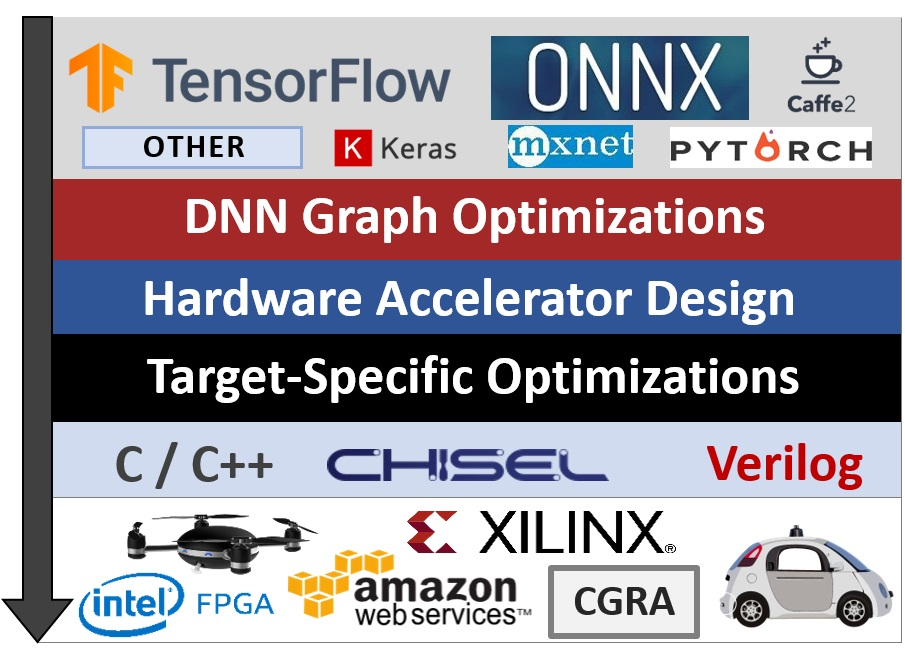

# TensorFlow to Spatial and Supported Operations

<p align="center">
</div>
</p>

### Contents
* Level 1: DNN Graph Operations
* Level 2: DNN Hardware Operations
* Level 3: Spatial Language Describing the Circuit

### Level 1: DNN Graph Operations

The following operations are supported at the DNN graph level:

* Convolutions of different strides/paddings/kernel sizes
* Poolings (e.g. max, average)
* Nonlinearities (e.g. ReLU, Sigmoid)
* Element-wise (e.g. Tensor Addition)
* Dropout
* BatchNorm
* Bias Addition
* Fully-Connected (matrix-vector multiplication)

In addition, TensorFlow contains many kernels and operations in its inference graphs to implement control or other functionality between the major compute operations. Our compiler automatically processes these operations, including:

* Explicit Pad nodes
* Identity (eliminated by compiler)
* Placeholder (we replace these with reading input files)
* No_op (eliminated by compiler)
* Switch/Merge (these implement control flow)
* Constant
* Shape (known statically, we replace this with the constant value)
* Preprocessing (e.g. split/concat, scaling, etc.)

### Level 2: DNN Hardware Operations

The optimized graph above then undergoes fusion, algorithm transformation and hardware instantiation.
This creates coarse-grained operations which are then expressed using various algorithms and mapped to processing units parallelized using a static model.
ElementWise, Nonlinearities and Pooling operations are fused into Conv/MatMul.
Examples of resulting coarse-grained operations in the DNN Hardware:

* Conv/Bias/ReLU/Pool
* MatMul/Bias/ReLU
* Conv/BatchNorm/ReLU (BN also folds into Bias)
* MatMul/Sigmoid

Currently only 32-bit computation is supported, but in the future lower precisions may also be supported.

### Level 3: Spatial Language Describing the Circuit

The generated circuit is described in the Spatial DSL (Hardware IR).
Spatial represents the fused operations described in the previous step as nested loop controllers with explicit memory hierarchy. 
The Spatial Compiler then performs optimizations such as memory banking and pipeline scheduling. 
For example, a Conv/Bias/ReLU operation with k > 1 may generate the following Spatial:

```scala
val k = 3 // Extracted from TF Graph
Foreach(out_channels by block_size) { outCh_i =>

  val conv_sram = SRAM[T](num_rows, num_cols, block_size)
  MemReduce(conv_sram)(in_channels by 1 par OUTER_PAR) { inCh_i =>
  
    // Load block of weights
    val weight_SRAM = SRAM[T](block_size*k*k)
    weight_SRAM load weights_DRAM(inCh_i, k*k*outCh_i :: k*k*(outCh_i+block_size))

    // Load input feature map
    val ifmap = SRAM[T](ifmap_size)
    ifmap load input_DRAM(inCh_i, 0::ifmap_size)

    val result = SRAM[T](num_rows, num_cols, block_size)
    Foreach(0 until num_rows, 0 until num_cols, 0 until block_size par INNER_PAR) { (r,c,b) =>
    
      // k x k reduction tree using Scala meta-programming
      
      val kernel: List[T] = List.tabulate(k){i => List.tabulate(k){j => 
        weight_SRAM(b*k*k + k*i + j)
      }}.flatten
      
      val data: List[T] = List.tabulate(k){i => List.tabulate(k){j => 
        ifmap((i+r)*num_cols + (j+c))
      }}.flatten
      
      result(r, c, b) = ReduceTree(
        data.zip(kernel).map{case (data_i, kernel_i) => data_i * kernel_i} :_*
      ){_+_}
      
    }
    result
  }{_+_} // Reduce across in channels
  
  // Fused BiasAdd, ReLU
  Foreach(block_size by 1) { b =>
    val fusion_sram = SRAM[T](ofmap_size)
    Foreach(0 until num_rows, 0 until num_cols) { (r,c) =>
      val bias = conv_sram(r,c,b) + bias_SRAM(outCh_i + b)
      val relu = max( 0.to[T], bias )
      fusion_sram(r*num_cols + c) = relu
    }
    output_DRAM(outCh_i + b, 0::ofmap_size) store fusion_sram
  }
}
```
